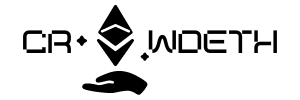

# NUS Orbital 2022 - Milestone II Submission

<!-- PROJECT LOGO -->
 

  

  <h3 align="center">CrowdETH</h3>
  
  

    Your one stop platform for secure crowdfunding
  

## Team Name
HawYeah

## Proposed Level of Achievement
Apollo 11

## Motivation

With the rise in entrepreneurship in Singapore, there is an increasing number of individuals who are seeking their own employment and way of life through start-ups.
However, starting such a venture is costly. This is where crowdfunding plays an important role in financing these new business ventures.

Crowdfunding has its merits, but there are some issues with crowdfunding which may deter potential crowd funders from participating.
1. Trust
2. Efficiency
3. Presence of third-parties and the administrative time needed for fund transfers

Crowdfunding will be a **more secure and transparent process** through the use of smart contracts and digitized tokens.

## Vision

**CrowdETH** will be the go-to platform for entrepreneurs and potential funders to connect. The web application harnesses the **unlimited potential of smart contracts** to improve the process of crowdfunding.

## User Stories
### Funder
- [ ] I want to be able to login to my account using my email so that I can access my account
- [ ] I want to be able to browse through potential crowdfunding opportunities to be able to choose the ventures I would like to crowfund for
- [ ] I want to track the status of the crowdfunding project that I donated for 
- [ ] I want to be able to connect my account to my cryptocurrency wallet so that I can transfer currencies to my crowdfunding projects
- [ ] I want to be able to top up and withdraw from my cryptocurrency wallet

### Entrepreneur
- [ ] I want to be able to pitch my idea on the web page to attract funders
- [ ] I want to see the status of the crowdfunding for my projects 
- [ ] want to be able to connect my account to my cryptocurrency wallet to receive the currency for my project funding

## Key Features
- [ ] A dual purpose login page for both entrepreneurs and investors
- [ ] A browsing page for investors to view various projects
- [ ] A page for entrepreneurs to upload their project details
- [ ] Cryptocurrency wallet for both investors and entrepreneurs for exchange of funds
- [ ] Implementation of Smart Contracts on Ethereum Blockchain for transaction

## Progression
### Core Features Developed
- [x] A dual purpose login page for both entrepreneurs and investors
- [x] User Registration & Authentication through Firebase
- [x] Integration of MetaMask Cryptocurrency wallet for both investors and entrepreneurs for exchange of funds
- [x] Implementation of Smart Contracts on Ethereum Blockchain for transaction (Awaiting Integration & Testing)
- [x] Functional Explore & Pitch Pages (Lacking front-back integration)

### Problems Faced
Problems faced were mainly on the integration of the backend side. 
1.  Explore and Pitch Pages are incomplete as we underestimated the difficulty of integrating the backend Firebase Database with the frontend side. As a result, we were unable to produce concrete front to back integration for the above 2 pages by Milestone II.
2.  Integration of MetaMask wallet into the system was not as smooth and bugs could still be present, awaiting to be **SQUASHED** by **MILESTONE III**.

### Looking Forward  
By Milestone III, we hope to complete the following:
1.  Complete Explore Page so funders are able to browse through the platform in search for ventures to invest
2.  Complete Pitch Page so entrepreneurs are able to pitch their ideas by posting on platform
3.  Setup About Us, Our Features Pages so that users can get to know more about the project and learn how to use it
4.  Complete Transaction and Profile Page for users to keep track of all transactions with Smart Contracts
5.  Full Front to Back Integration for all pages
6.  User Testing
7.  Complete Full Documentation on deployment of Tech Stack :D
8.  Aim to improve and smoothen all user experience (i.e. Moving from alerts to proper pop up messages to inform users on errors faced)   

*_Should there be any bugs found by users, please do feedback in the Milestone II Feedback! All feedbacks are greatly appreciated!_  
_Apologies if anyone faces user bug during their testing_

## Documentations

- [Figma Technical Proof of Concept](https://www.figma.com/proto/uPUSzbwsr3ooL7ELvyhIEj/CrowdETH-Wireframing?node-id=500073%3A404&scaling=scale-down&page-id=500073%3A267&starting-point-node-id=500073%3A404)
- [Prototype Link (Live)](https://nus-crowdeth.herokuapp.com)

## Tech Stack
 <!-- markdownlint-disable MD033 -->
 <!-- The lack of line breaks within anchor tags is due to a weird underline appearing when line breaks are present. -->

  
  &nbsp;
  
  &nbsp;
  
  &nbsp;
  
  &nbsp;
  
  &nbsp;
  
  &nbsp;
  
  &nbsp;
  

<!-- markdownlint-enable MD033 -->